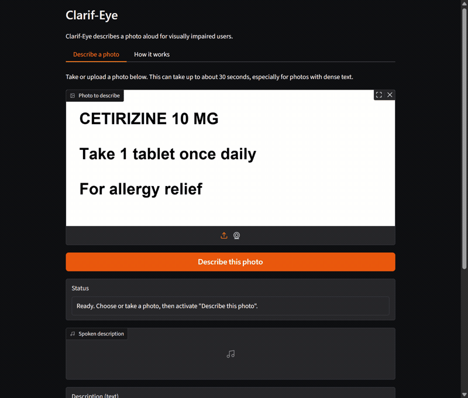

# Clarif-Eye

[](https://github.com/franciszver/clarif-eye/actions/workflows/ci.yml)

Try it live: [https://clarif-eye.onrender.com](https://clarif-eye.onrender.com).
It runs on a free hosting tier, so if it has been idle the first request
can take about 60 seconds to wake it up; see [Deployment](#deployment) for
why.

Clarif-Eye is a working demonstration of what [LangGraph](https://github.com/langchain-ai/langgraph)
can do, built as a real, usable application rather than a toy example.
The vehicle is an accessible vision assistant: point a camera at a bill,
a label, or a document, and the app reads the text, describes the scene,
and speaks the result back to you. On documents with dense numbers, such
as an itemized bill, it does extra work to check that every amount it
plans to say aloud actually traces back to the photographed text before
speaking it. Both halves are true at once: the app genuinely helps
someone who cannot see the photo they are describing, and the code
underneath exercises most of what LangGraph offers, in ways a reader can
verify rather than take on faith.



▶ [Watch the demo with the app's real spoken narration](docs/demo.mp4) (the GIF above is silent; the MP4's audio is the TTS narration generated by the same live run).

## LangGraph capabilities this repo demonstrates

Every row below names the file and the symbol that implements it, and a
test (`tests/test_readme_capabilities.py`) imports every one of them, so
this table cannot silently drift out of date with the code.

| Capability | What it looks like here | Demonstrated by |
|---|---|---|
| `StateGraph` with conditional edges | A static branch on a flag one node already computed: `vision` sets a complexity flag, `dynamic_router` reads it to choose the fast path or the deep path. | `clarif_eye.graph.build_graph`, `clarif_eye.graph.dynamic_router` |
| `Command(goto=...)` routing | A node that decides its own successor instead of handing off to a separate router function. The entry node reads the run's own input (a photo or a typed question) and routes itself. | `clarif_eye.graph.entry_node` |
| Streaming with per-node narration | The compiled graph is driven with `stream_mode="updates"`, so each completed node's name is available as it finishes, not only the final result. That drives the app's spoken progress updates. | `clarif_eye.ui._narrate_stream` |
| Checkpointing and threads | Conversation state persists across turns on a `thread_id`, so a follow-up question can be answered from what an earlier photo already read. | `clarif_eye.graph.build_graph`, `clarif_eye.ui.build_resources`, `clarif_eye.ui.ThreadRegistry` |
| Pluggable checkpointer backends | The checkpointer is selected by an environment variable, not hardcoded: unset, the app compiles with `InMemorySaver`, exactly as above; `CLARIFEYE_CHECKPOINT_DB=<path>` set, it compiles with a `SqliteSaver` over that file instead, and a pause survives a brand-new process reopening the same file. See [Deployment](#deployment) for why this is a demonstration of the persistence contract rather than a durability guarantee on the live site. | `clarif_eye.graph.make_checkpointer` |
| Reducers | The conversation history key accumulates across runs instead of being overwritten by each new one, and is capped so a long-lived thread's checkpoint does not grow without bound. | `clarif_eye.state.ClarifEyeState`, `clarif_eye.state._keep_last_n_messages` |
| `update_state` at the conversation boundary | A completed turn is written onto the thread once, from outside any node, rather than inside the node that happened to run last. | `clarif_eye.ui._record_turn` |
| Human-in-the-loop interrupt and `Command(resume=...)` | When a number in a drafted script cannot be traced back to the photographed text, the run pauses and asks the user whether to hear it anyway or take a new photo, instead of guessing. | `clarif_eye.graph.verify_numbers_node` |
| Subgraphs with their own schema | The deep-analysis path is a separate compiled graph with its own state, mounted in the main graph through a small wrapper. Its checkpoints hold no photo, because its schema has no field for one. A pause raised inside it still reaches the caller of the main graph. | `clarif_eye.deep_path.build_deep_path_graph`, `clarif_eye.graph.make_deep_path_node` |
| Cross-thread `Store` | A spoken-verbosity preference set on one conversation thread is readable from a different thread in the same browser session, which a per-thread checkpoint cannot do on its own. | `clarif_eye.preferences.set_verbosity`, `clarif_eye.preferences.get_verbosity` |

## Node policies: evaluated, not adopted

LangGraph also ships built-in per-node policies for retries, timeouts,
caching, and error handling. Each one was tested against this app's
existing, hand-rolled equivalent, with a runnable script and its recorded
output, before deciding whether to switch. The verdict in every case was
to keep the hand-rolled version, for reasons specific to how this app
runs today. See [docs/NODE-POLICIES.md](docs/NODE-POLICIES.md) for the
comparison and `scripts/experiment_*.py` for the scripts themselves.

## The product, honestly described

This is a portfolio demo, not a product. It runs entirely on free-tier
models from [OpenRouter](https://openrouter.ai/), which keeps the running
cost at zero but means responses are slower and less reliable than a paid
model would be. A request on the closer-look path (dense documents that
need number verification) has measured 21 to 31 seconds end to end. The
app tells you up front to expect up to about 30 seconds.

See [docs/ACCESSIBILITY.md](docs/ACCESSIBILITY.md) for what has actually
been verified about the screen-reader experience, and what has not.

## Running it locally

Requires Python 3.11 or later.

```bash
pip install -e .
```

The app calls OpenRouter, so it needs an API key in the environment:

```bash
export OPENROUTER_API_KEY=your-key-here
python app.py
```

This starts a local Gradio server and prints its URL.

For development setup (installing test dependencies, running the test
suite), see [CONTRIBUTING.md](CONTRIBUTING.md).

## How it works

1. You take or upload a photo.
2. A vision-language model reads any text in the photo and separately
   describes the scene (what it is, its layout).
3. A router decides, from that text alone, whether a quick description is
   enough or the document is dense enough to need a closer look (an
   itemized bill, a prescription label, a form with numbers on it). This
   decision is plain Python, no model or network call, scoring things like
   digit density, currency amounts, and document keywords.
4. If a quick description is enough, the photographed text and scene
   description are turned directly into the spoken script.
5. If a closer look is needed, the app first does a web search related to
   what was photographed, then a stronger text-reasoning model writes the
   script from the photographed text, the scene description, and whatever
   the search turned up.
6. On that closer-look path, before anything is spoken, every number in the
   drafted script is checked against the photographed text. If a number
   doesn't trace back to what the camera actually saw, the app stops and
   asks: it reads out the description it wrote, says which number it could
   not check, and offers two buttons - hear it anyway, or take a new photo.
   Nothing is read aloud as fact until you choose, and this is the only
   thing the app ever stops to ask you about.
7. The final script is converted to speech.

The pipeline is built with LangGraph's `StateGraph`, wired the way the
table above describes. Every model call goes through one of two roles,
"eyes" (reads the photo) and "brain" (writes the closer-look description),
each an ordered ladder of free models tried in turn if an earlier one
fails. If speech synthesis fails, the app still shows the description as
text rather than failing silently.

The in-app "How this works" panel (visible once the app is running)
carries the same explanation, kept in sync with the code by a test. For
more detail, including what a real screen-reader pass did and did not
confirm, see [docs/ACCESSIBILITY.md](docs/ACCESSIBILITY.md). For how the
external systems this app depends on (the model API, search, text-to-speech)
are checked against real calls rather than only mocks, see
[docs/SCENARIOS.md](docs/SCENARIOS.md).

## Deployment

Clarif-Eye runs on Render's free tier, configured in
[render.yaml](render.yaml). Two things to know before you rely on the live
URL:

- **The app sleeps after 15 minutes with no traffic.** Waking it back up
  takes about a minute, during which Render shows its own loading page.
  This is on top of the 21 to 31 second pipeline latency noted above; a
  cold visit can take close to two minutes end to end.
- **That loading page is Render's, not this app's.** Whether it announces
  itself to a screen reader has not been checked, because it is outside
  this app's control. A blind user may spend that first minute on a page
  nobody here has verified.

The host supplies `OPENROUTER_API_KEY` as an environment variable in its
own dashboard. `.env` is never deployed; it exists only for running the
app locally.

- **`CLARIFEYE_CHECKPOINT_DB` is not set on the live deployment, and the
  default stays `InMemorySaver`.** The variable exists so this app can
  demonstrate LangGraph's pluggable persistence contract (see the
  capability table above) - setting it swaps in a `SqliteSaver` over a
  file, and a pause on that file survives a brand-new process reopening
  it. But Render's free tier gives the container an EPHEMERAL filesystem:
  the sqlite file does not survive a redeploy or a restart there, so
  setting the variable on this specific host would not add real
  durability, only a database file that vanishes at the next cold start.
  Real durability from `SqliteSaver` accrues to anyone running this app on
  a persistent disk - a paid Render disk, a VM, a container with a mounted
  volume - which is not what the free tier gives it today.
- **What that file would hold, at rest, if it did persist.** Every
  LangGraph checkpoint stores the WHOLE state of the graph that wrote it -
  for this app, that means `image_data` (a base64 JPEG of the photographed
  label or bill) and `ocr_output` (the text a model read off it), sitting
  unencrypted in a plain sqlite file on disk, for as long as that file and
  its thread survive. That is precisely the data this app's cross-thread
  preference store refuses to hold even in memory (see
  `clarif_eye.preferences`'s own "PRIVACY, NON-NEGOTIABLE" comment) -
  photographs of medication labels and bills, from users who did not
  expect them to outlive one sitting. Enabling `CLARIFEYE_CHECKPOINT_DB`
  is an explicit trade: the operator who sets it is choosing at-rest
  persistence over the session-scoped privacy `InMemorySaver` gives by
  default (everything gone the moment the process exits), and takes on
  responsibility for that file's filesystem protection and its retention
  or deletion. That is why the deployment default stays `InMemorySaver`.

## License

MIT, see [LICENSE](LICENSE).
